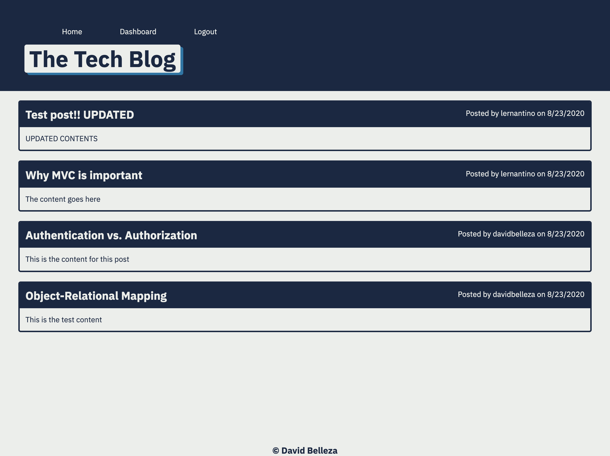

# The Tech Blog 

## Description
A CMS-style blog site that allows the user to create blog posts and comment on other user posts. The user can also edit and delete their posts. 

## Table of Contents
* [Installation](#installation)
* [Usage](#usage)
* [Built With](#builtwith)
* [Questions](#questions)
    
## Installation
Run npm install to install the required packages. Create an .env file to create the necessary database information such as database name, MySQL username, and MySQL password.

## Usage
The user must first run the schema.sql file on their MySQL server to create the tech-blog database. The user can then start the server using Node. The user can then go to http://localhost:3001 to test the site. In order to create posts, the user must login on the Login page or create an account on the Sign Up page.

[Deployed site](https://belleza-tech-blog.herokuapp.com/)

## Builtwith
* JS
* Node
* MySQL
* Express
* Sequelize
* Handlebars

## Questions
Visit my Github
[d-belleza](https://github.com/d-belleza)

Additional questions, please send an email at
[davidbelleza@gmail.com](mailto:davidbelleza@gmail.com)